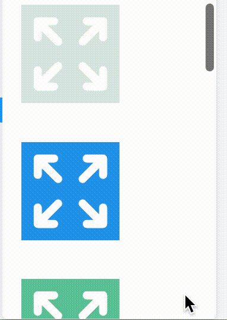
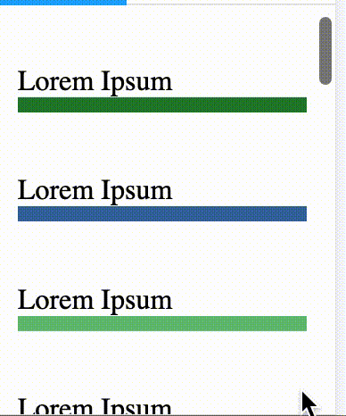

# React Scroll Zoom Effect

<div style="display: flex; gap: 1vw;">



</div>

## Make your page more dynamic with scroll effects.

Install:

```
npm install react-scroll-zoom-effect
yarn add react-scroll-zoom-effect
```

How to use:

```
<ZoomScroll>
	<YourComponent />
</ZoomScroll>
```

If you have an image, SVG, etc make sure you contain its size:

```
<div style={{width: "5rem", height: "5rem"}}>
    <ZoomScroll>
        <YourComponent />
    </ZoomScroll>
</div>
```

Example gif 1 uses param max={1.1}\
Example gifs 2 and 3 use no params

## Params

Scale: number\
TBD\
Currently # >= 0\
Default: 100

Max/Min: number\
TBD\
Currently # >= 0\
Default: 0\
Notes: Works well with 1~2

Shrink: boolean\
Shrink instead of zoom\
Default: false

Show: boolean\
Toggle zoom effect on/off\
Example: only show on dark mode\
Default: true

### To Do List

- [ ] Test Cross Browser Support
