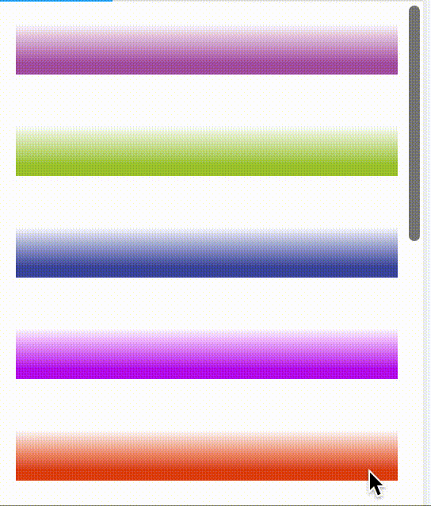

# React Scroll Zoom Effect

<div style="display: flex; flex-direction: column; gap: 1vw;">
    <div style="display: flex; gap: 1vw;">
        
        
    </div>
    <div style="display: flex; gap: 1vw;">
        
        
    </div>
</div>

## Make your page more dynamic with scroll effects.

Install:

```
npm install react-scroll-zoom-effect
yarn add react-scroll-zoom-effect
```

How to use:

```
<ZoomScroll>
	<YourComponent />
</ZoomScroll>
```

## Examples

Icon examples use max={1.1}\
Gradient example from gif above:

```
<div
    style={{
        marginBottom: "2rem",
        height: "2rem",
        background: "blue",
        width: "100%",
    }}
>
    <ScrollZoom
    scale={200}
    style={{
        height: "2rem",
        background:
        "linear-gradient(to bottom, rgba(255,255,255,1) 0%,rgba(255,255,255,0) 75%,rgba(255,255,255,0) 100%)",
    }}
    ></ScrollZoom>
</div>
```

## Params

### Sway: boolean

Move with direction of scroll\
Default: false\
Example: Lists, Dividers , masks , gradients

### Shrink: boolean

Shrink instead of zoom\
Default: false
Example: UI regions

### Show: boolean

Toggle zoom effect on/off\
Example: Only show on dark mode\
Default: true

### Max/Min: number

TBD\
Currently # >= 0\
Default: 0\
Notes: Works well with 0~0.5
Ref storybook examples

### Scale: number

TBD\
Default: 100

### To Do List

- [ ] Point CodeSandBox to StoryBook instead of src/index
- [ ] Export type definitions
- [ ] Test Cross Browser Support
