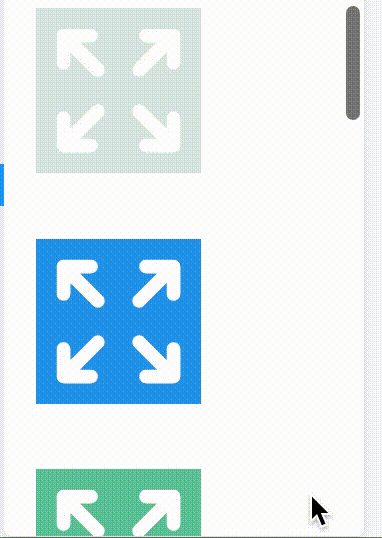
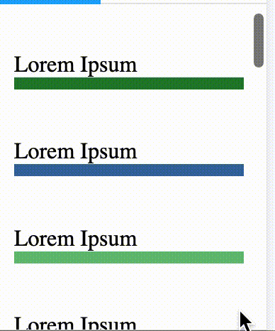

# React Scroll Zoom Effect

 

## Make your page more dynamic with scroll effects.

Install:

```
npm install react-scroll-zoom-effect
yarn add react-scroll-zoom-effect
```

How to use:

```
<ZoomScroll>
	<YourComponent />
</ZoomScroll>
```

If you have an image, SVG, etc make sure you contain its size:

```
<div style={{width: "5rem", height: "5rem"}}>
    <ZoomScroll>
        <YourComponent />
    </ZoomScroll>
</div>
```

## Params

Scale: number\
TBD\
Currently # >= 0\
Default: 100

Max/Min: number\
TBD\
Currently # >= 0\
Default: 0\
Notes: Works well with .1~1

Shrink: boolean\
Shrink instead of zoom\
Default: false
